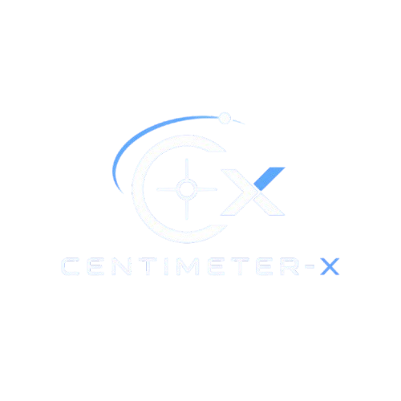

<div align="center">
  

  **Posicionamento de alta precisão como serviço**

  Aplicativo mobile da Global Solution FIAP — edição *Space Connect*.
</div>

---

## 🎯 Objetivo

O **Centimeter-X** é a plataforma cliente de um serviço de **posicionamento de alta precisão
(centímetros)**. Ela combina **correção GNSS** (satélites GPS/Galileo, do espaço) com uma rede de
**estações-base terrestres** para entregar localização em nível de centímetro — algo que o GPS
comum (3–10 m) não alcança.

O app é o **painel do cliente**: por ele o usuário cadastra seus equipamentos ("rovers"),
inicia sessões de correção, acompanha a precisão atingida em tempo real e registra ocorrências
de campo. O processamento pesado (cálculo da correção a partir de dados reais de órbita + solo)
fica no backend.

**Clientes-alvo:** agricultura de precisão, veículos autônomos, drones e topografia.

## 🛰️ Tema (Global Solution — Space Connect)

A solução depende intrinsecamente da ponte **espaço + solo**: o sinal dos satélites GNSS é
corrigido por infraestrutura terrestre e por **produtos abertos da NASA** (CDDIS / IGS — órbitas
precisas SP3, relógios CLK e observações RINEX). É exatamente o uso de tecnologia espacial para
resolver desafios reais na Terra proposto pela Global Solution.

**ODS relacionadas:** 9 (Indústria e Inovação), 11 (Cidades Sustentáveis), 2 (Fome Zero / agro
de precisão).

## 📱 Funcionalidades

- **Login / cadastro** com validação e autenticação JWT.
- **Dashboard** com resumo da operação (rovers ativos, estações online, última precisão).
- **Listagem e cadastro de rovers** (busca, pull-to-refresh).
- **Detalhe do rover** com **mapa** mostrando rover ↔ estação-base e a distância (baseline).
- **Sessão de correção**: inicia o serviço e exibe a precisão alcançada (FIX/FLOAT/SINGLE),
  satélites usados, constelação e fonte da correção.
- **Registro de ocorrências de campo** usando **GPS + câmera**.
- **Histórico** de sessões e ocorrências.

## 📲 Recurso mobile utilizado

O app usa **dois recursos nativos**:

- **GPS / Localização** (`expo-location`) — georreferencia ocorrências de campo e a posição do
  rover, refletindo o uso real por operadores de máquinas agrícolas e topógrafos.
- **Câmera** (`expo-image-picker`) — anexa evidência visual (foto) à ocorrência.

Há também um **mapa** (`react-native-maps`) que torna explícita a relação espacial
satélite → estação-base → rover.

## 🧱 Stack

- **React Native + Expo** (SDK 56), **TypeScript**
- **React Navigation** (stack + tabs)
- **Axios** com interceptors (JWT + refresh automático + tratamento de erros)
- **AsyncStorage** (sessão), **expo-location**, **expo-image-picker**, **react-native-maps**
- **expo-linear-gradient** + **@expo/vector-icons** (UI)

Backend (em desenvolvimento): **Java + Spring Boot** consumindo dados reais GNSS da NASA/IGS —
contrato completo em [`API.md`](API.md) e visão geral em [`SOLUTION.md`](SOLUTION.md).

## 📂 Estrutura

```
centimeter-x-app/
├── App.tsx
├── app.json
└── src/
    ├── components/   # UI reutilizável (botão, card, badge, input, mapa, splash...)
    ├── screens/      # telas (login, dashboard, rovers, sessão, ocorrência, histórico)
    ├── navigation/   # stacks + tabs
    ├── services/     # cliente axios + serviços REST + adaptador mock
    ├── context/      # AuthContext
    ├── hooks/        # useLocation, useCamera
    ├── utils/        # validação, geo (haversine), labels, storage
    ├── types/        # modelos do domínio
    ├── config/       # env (API base URL, modo de teste)
    └── theme/        # design system (cores, gradientes, tipografia)
```

## ▶️ Como executar

Pré-requisitos: **Node 18+**, **npm**, e o app **Expo Go** (celular) ou um **emulador Android/iOS**.

```bash
cd centimeter-x-app
npm install
npx expo start
```

- Pressione **`a`** para abrir no emulador Android (ou **`i`** no iOS), ou escaneie o QR code
  com o **Expo Go**.

### Modo de teste (sem backend)

Enquanto a API não está no ar, o app roda com **dados simulados em memória**
(flag `USE_MOCK` em [`src/config/env.ts`](centimeter-x-app/src/config/env.ts)).
Na tela de login, toque no box **"Modo de teste"** para preencher as credenciais:

- **E-mail:** `teste@centimeter.com`
- **Senha:** `teste1234`

### Apontando para o backend real

Quando o backend Spring Boot estiver disponível, defina `USE_MOCK = false` e ajuste a
`apiBaseUrl` em [`app.json`](centimeter-x-app/app.json) → `extra.apiBaseUrl`. Em dispositivo
físico, use o IP da máquina na rede local (ex.: `http://192.168.0.10:8080/api/v1`).

> **Mapa no Android:** no Expo Go o mapa renderiza com a chave do próprio Expo. Para um build
> standalone (APK/AAB), configure a chave do Google Maps em `app.json`
> (`android.config.googleMaps.apiKey`).

## ✅ Cobertura dos requisitos (rubrica)

| Critério | Onde |
|---|---|
| Interface mobile | 9 telas organizadas + componentes reutilizáveis (`src/components`, `src/screens`) |
| Navegação e fluxo | login → rovers → detalhe → sessão → ocorrência → histórico (`src/navigation`) |
| Manipulação de dados | serviços REST + estado + AsyncStorage; dados reais NASA/IGS no backend |
| Recurso mobile | GPS + câmera (`src/hooks`) e mapa (`PositioningMap`) |
| Tratamento de erros/validações | validações de formulário, permissão negada, falha de rede, 404 |
| Organização do projeto | estrutura em camadas, TypeScript, este README |

## 📄 Documentação adicional

- [`SOLUTION.md`](SOLUTION.md) — visão da solução, arquitetura e fontes de dados NASA.
- [`API.md`](API.md) — contrato REST, requisitos de segurança e modelo de dados.
